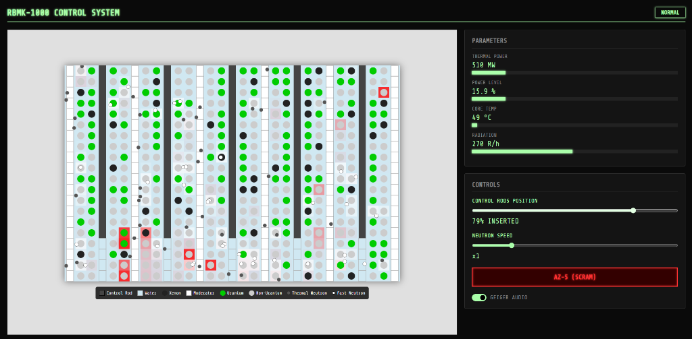

# RBMK-1000 Core Visualization

An interactive web-based simulation of the Chernobyl RBMK-1000 reactor core, inspired by the "Mission To Fission" educational game. This project visualizes the complex physics of a nuclear reactor, including neutron moderation, control rod absorption, and xenon poisoning, wrapped in a retro-industrial aesthetic.

## Features

*   **Interactive Core Grid**: Visualizes fuel channels, control rods, and moderators.
*   **Particle Physics**: Simulates Fast and Thermal neutrons.
    *   **Moderators** slow down fast neutrons.
    *   **Control Rods** absorb neutrons.
    *   **Uranium Fuel** reacts with thermal neutrons to generate power and heat.
*   **Dynamic Heat System**:
    *   **Water Heating**: Visual pink-to-red gradient as water temperature rises.
    *   **Positive Void Coefficient**: At high temperatures ("Red Hot"), fuel becomes more reactive, simulating the dangerous positive feedback loop that led to the disaster.
*   **Fuel Cycle**:
    *   Uranium turns into Spent Fuel or Xenon.
    *   Xenon poisoning absorbs neutrons, dampening the reaction.
*   **Audio Feedback**: Realistic Geiger counter sound effects that scale with radiation levels.

## Controls

*   **Control Rods Position**: Slide to insert or withdraw control rods. Withdrawing rods increases reactivity.
*   **Neutron Speed**: Adjust the simulation speed. Physics (heating/boiling) scale proportionally.
*   **AZ-5 (SCRAM)**: Emergency shutdown button. Rapidly inserts all control rods to kill the reaction.
*   **Geiger Audio**: Toggle the radiation sound effects.

## Technical Details

Built with vanilla HTML5, CSS3, and JavaScript.
*   **Rendering**: HTML5 Canvas for high-performance particle and grid rendering.
*   **Audio**: Web Audio API for procedurally generated Geiger counter clicks.

## How to Run

Simply open `index.html` in any modern web browser.
